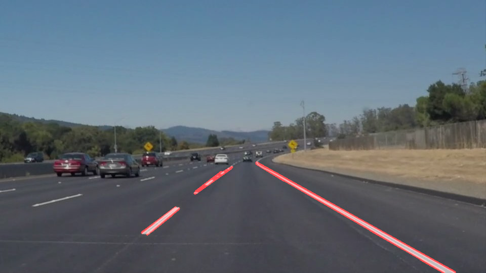

# **Finding Lane Lines on the Road** 

**Finding Lane Lines on the Road**

The goals / steps of this project are the following:
* Make a pipeline that finds lane lines on the road
* Reflect on your work in a written report

---

### Reflection

### 1. Describe your pipeline. As part of the description, explain how you modified the draw_lines() function.

My pipeline consisted of 5 steps. First, I converted the images to grayscale, then I use the gaussian to normaliza the grayscale points. After that , I used the CV function canny to find the edges. Then, I set up the region of interest to find the region that I care about. Then I used the hough_line function to find the lane and draw them out. 

In order to draw a single line on the left and right lanes, I modified the draw_lines() function by three steps. Firstly, I separated line by using the slopes into right lane and left lane. Then, I used find the mean over all the point of each lane. After that, I can use the mean point to extrapolate out to get the bottom and top points. I had to redo the region of interest again, because we extrapolated lines over the whole region. 

### 2. Identify potential shortcomings with your current pipeline

One potential shortcoming would be what would happen when there are some outliers will mess up all the lines. 

Another shortcoming could be the region of interest is the same for all the pictures, but in reality it may need to be changed over the time. 

### 3. Suggest possible improvements to your pipeline

A possible improvement would be to add some data filters at the beginning of processing.

Another potential improvement could be to make a dynamic region of interest based on some criteria. 
